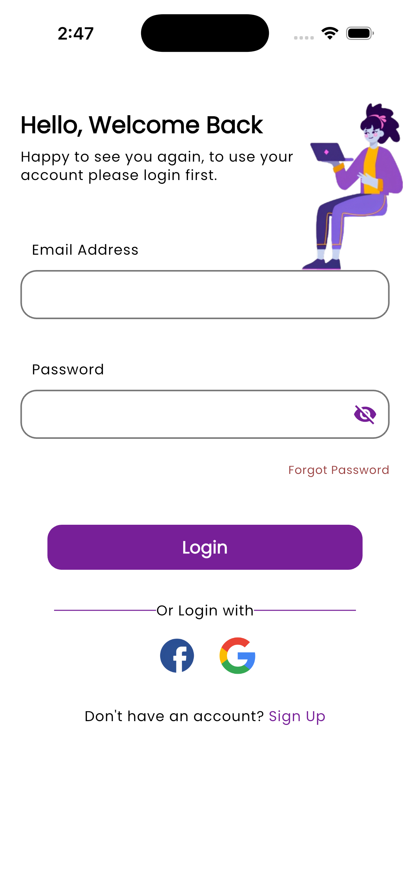
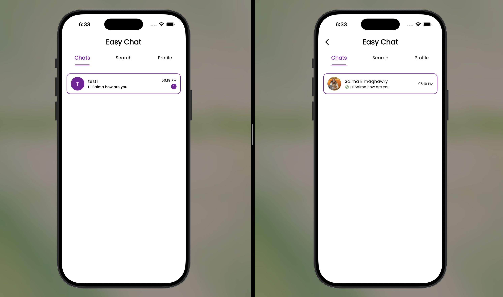
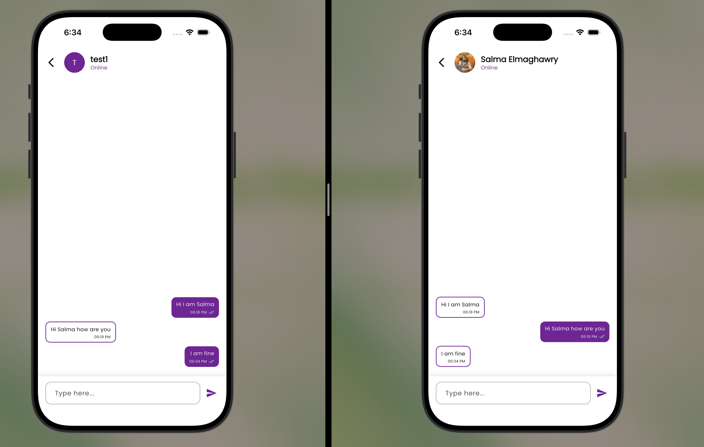
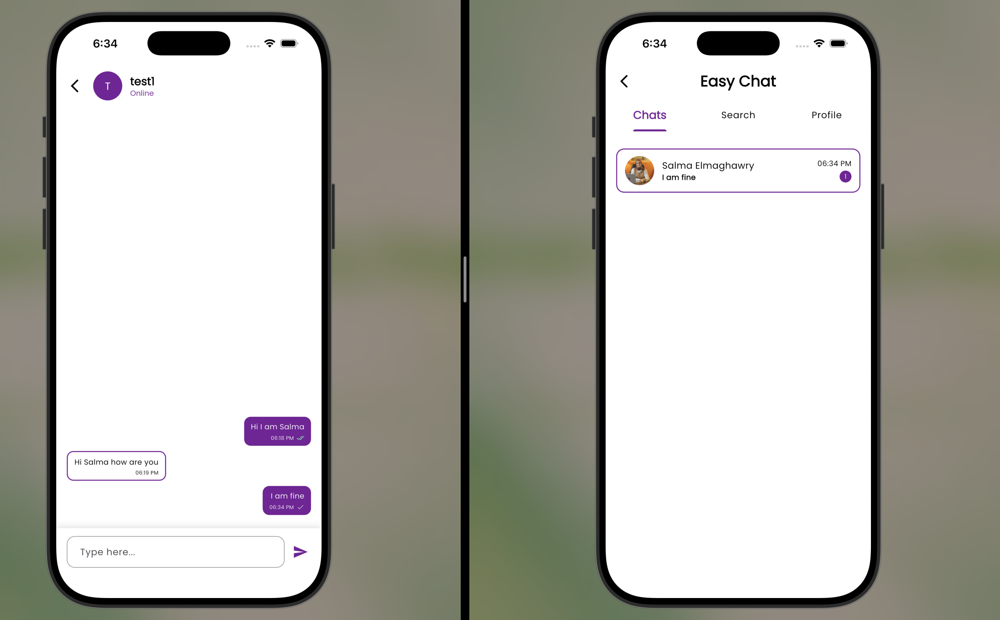
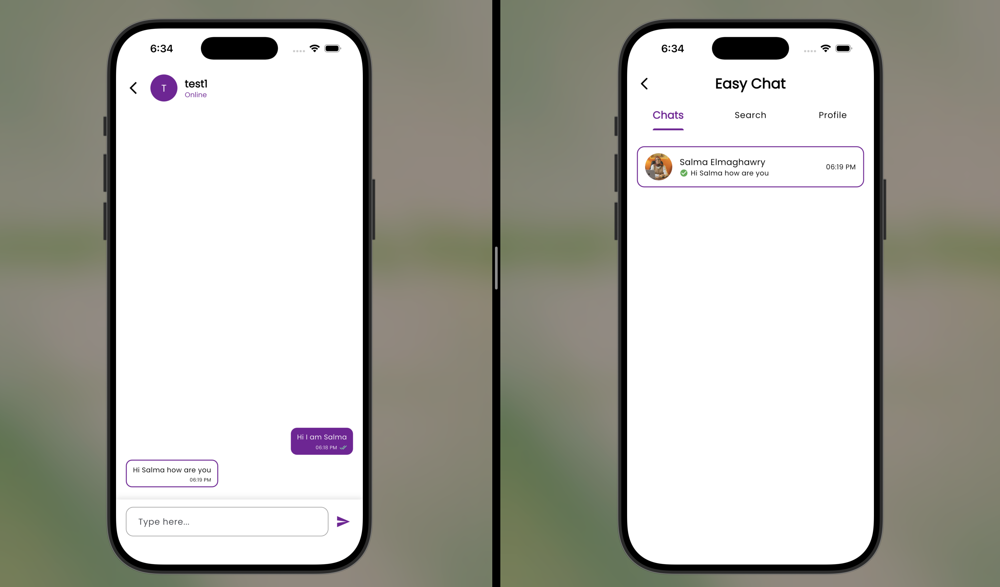

# Easy Chat 💬

A real-time one-to-one chat app built with **Flutter** and **Firebase**.
Users sign up with email or Google, search for other users, and chat live with online status, read receipts and unread counters.

## Demo

▶️ **[Watch the full demo on YouTube](https://youtu.be/Z3N4eKLP8lM)**

Two devices chatting live: messages, unread badges, read receipts and online status all update instantly on both sides.

| Login (email or Google) |
| :---: |
|  |

| Chats list (both users) | Real-time conversation |
| :---: | :---: |
|  |  |

| Unread badge | Read receipts |
| :---: | :---: |
|  |  |

## Features

**Authentication**
- Email & password sign up / login with email verification
- Google Sign-In
- Forgot password (reset email)

**Chat**
- Real-time one-to-one messaging with Cloud Firestore streams
- Chats list sorted by latest message, with last message preview and time
- Unread message counter per chat
- Read receipts (✓ sent, ✓✓ seen)
- Online / offline presence that follows the app lifecycle (foreground / background)

**Search**
- Search users by name (prefix search)
- Paginated results (10 per page) with infinite scroll

**Profile**
- View and update profile info
- Upload a profile picture (stored on Supabase Storage)
- Avatar falls back to the user's initial when no photo is set

## Tech Stack

| Layer | Tools |
| --- | --- |
| UI | Flutter, `flutter_screenutil`, Poppins font |
| State management | `flutter_bloc` (Cubit) |
| Backend | Firebase Auth, Cloud Firestore |
| Storage | Supabase Storage (profile images) |
| Other | `google_sign_in`, `image_picker`, `shared_preferences`, `intl` |

## How it works

**Firestore structure**

```
users/{uid}                        name, email, photo, isOnline, lastSeen
chats/{uidA_uidB}                  participants, lastMessage, lastMessageAt, unreadCount
chats/{uidA_uidB}/messages/{id}    senderId, receiverId, message, createdAt, status, readBy
```

**Design decisions**
- **Deterministic chat ID:** the two user IDs are sorted and joined (`uidA_uidB`), so both users always open the same chat and duplicates are impossible.
- **Atomic writes:** sending a message writes the message and updates the chat summary in a single batch, so the chats list is never out of sync.
- **Server-side counters and timestamps:** `FieldValue.increment` and `serverTimestamp` are used, so messages sent at the same moment are counted correctly and ordering doesn't depend on the phone's clock.
- **Search race protection:** each search gets a request ID, so a slow old request can't overwrite the results of a newer one.
- **Security rules:** any signed-in user can read profiles (needed for search) but can only edit their own; only the two participants can read or write a chat and its messages. See [firestore.rules](firestore.rules).

## Project Structure

Feature-first structure:

```
lib/
├── core/            # theme, routes, helpers, shared widgets
└── features/
    ├── auth/        # login, sign up, email verification, Google sign-in
    ├── intro/
    ├── home/        # tabs + online presence
    ├── chat/        # chats list, chat screen, message models
    ├── search/      # paginated user search
    └── profile/     # profile + image upload
```

## Getting Started

1. Clone the repo
   ```bash
   git clone https://github.com/salma-elmaghawry/simple_chat_app.git
   cd simple_chat_app
   ```
2. Install packages
   ```bash
   flutter pub get
   ```
3. Connect your own Firebase project
   ```bash
   flutterfire configure
   ```
   Then enable **Email/Password** and **Google** sign-in in Firebase Auth, and deploy the rules:
   ```bash
   firebase deploy --only firestore:rules
   ```
4. Set your Supabase URL and anon key in `lib/main.dart`, and create a storage bucket for profile images.
5. Run
   ```bash
   flutter run
   ```

## Author

**Salma Elmaghawry**: [GitHub](https://github.com/salma-elmaghawry)
